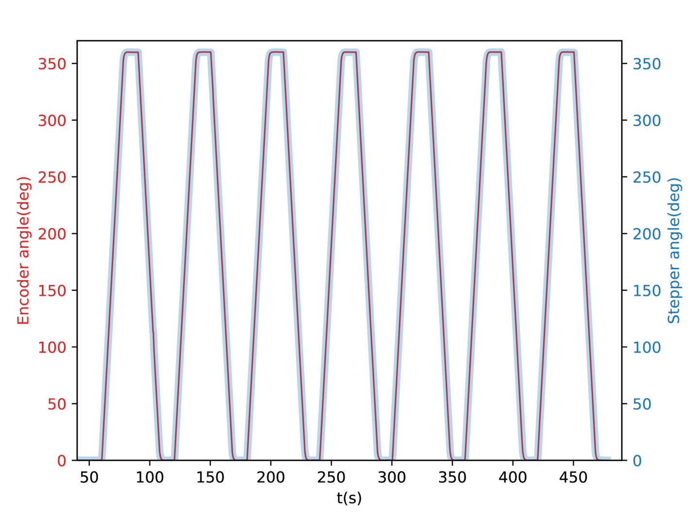

Terminology and measurements in this section follow [this document](https://www.newport.com/n/motion-basics-terminology-and-standards). 
Users should conduct their own characterization with the specific platform weights and weight distributions. 

The rotary stage's accuracy and repeatability have been evaluated by recording the angle (°) of the incremental encoder (2400 pulses per revolution) and the angle obtained from the teensystep step counter simultaneously. Figure 1 shows an example test of the stage performance, in this case without the load of the head holder. The stage is repeatedly sent to the set point positions (0 and 360 degrees). The final positions are highly accurate (360.06 ± 0.11° and 0.04 ± 0.07°), suggesting little error accumulation. 

|  |
|:--:|
| *Figure 1. Rotary stage performance* |

Data and code for this characterization are available [here](data/rotary_stage_validation/Closed%20loop%20without%20load/closed_loop_without_load.zip).

## Minimum incremental motion (MIM) and backlash
The minimum incremental motion reliably measured corresponds to 0.1 degrees. The backlash, in the worst-case scenario corresponding to the offset created by the change in direction of the MIM tests, has been 0.04 degrees.

|  |
|:--:|
| *Figure 2. Minimum incremental motion measurement* |

Data and code for this characterization are available [here](data/rotary_stage_validation/Minimum%20incremental%20motion%20(MIM)/MIM.zip).

## Accuracy and repeatability
In order to evaluate the accuracy and repeatability of the rotary stage, a sequence of increments of 45 degrees in both rotation directions has been performed, collecting 8 position deviations in each direction (16 per each velocity/acceleration condition). The overall accuracy and repeatability have been calculated from all conditions according to the following equations:

Accuracy:

Repeatability:

Where xi and si are the average inaccuracy and the standard deviation, respectively, at position i. Up and down arrows represent the positive and negative directions. 

|  |
|:--:|
| *Figure 3. Accuracy and repeatability test sequence (a) and*|
| *average of absolute position deviation in every angular velocity and acceleration condition (b)* |

## Closed-loop characterization

For the closed loop algorithm, the stability of the system response has been evaluated by the analysis of the step response for all previously described conditions (20-100 °·s¯¹ and 200-1200 °·s¯²). A contour plot has been extracted to be used as a map to avoid regions of inaccuracy and instability. Sometimes even achieving a small error the stage can overshoot as shown in Figure 4 (right). 

|  |
|:--:|
| *Figure 4. Example step functions (0-90°) at different velocity and acceleration values.*|
| *(left) 20 °·s¯¹, 200 °·s¯². (right) 100 °·s¯¹, 1200 °·s¯².*| 

Figures 5 highlight regions in red to avoid errors and instability around the setpoint. 

|  |
|:--:|
| *Figure 5. Average (left) and standard deviation (right) of the absolute position deviation.* |

Data and code for this characterization are available [here](data/rotary_stage_validation/Closed%20loop/closed_loop.zip).

# Specifications and characterization of the rotary stage

| parameter					         	| value	|
|--------------------------------------	|--------	|
| Resolution stepper motor (°)         	| 0.0024 	|
| Resolution of the encoder (°)       	| 0.024  	|
| Accuracy (°)                         	| 0.37   	|
| Repeatability (°)                    	| 0.1    	|
| Minimum incremental motion (°)       	| 0.1    	|
| Maximum angular velocity (°·s¯¹)     	| 100    	|
| Maximum angular acceleration (°·s¯²) 	| 1200   	|
| Backlash (°)                         	| 0.04   	|