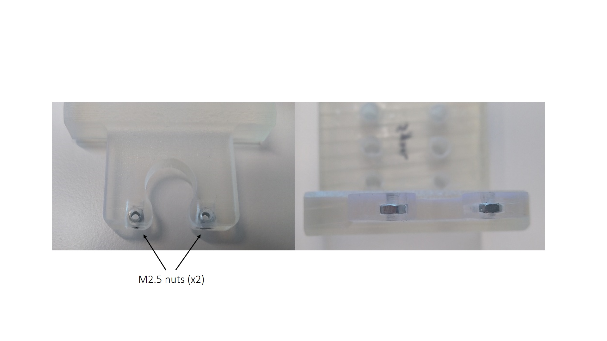

# Assembly

We show an example assembly using the MT1/M linker with camera holder lip, the Head-plate holder 2, the MM33 micromanipulator and the probe holder. 

|  |
|:--:|
|  |
|:--:|
|  |
| *Head-holding system assembly* |

The head-plate is secured in the head-plate holder using 2 M2.5 screws. For this end, 2 M2.5 nuts are inserted into the head-plate holder. 

|  |
|:--:|
| *Head-plate holder nuts insertion* |

Finally, the assembly is secured to the ring-shaped instrument platform with M6 screws and connected to the rotary platform using RS6P/M posts.

|  |
|:--:|
| *Head holding system and instrument ring assembly* |
