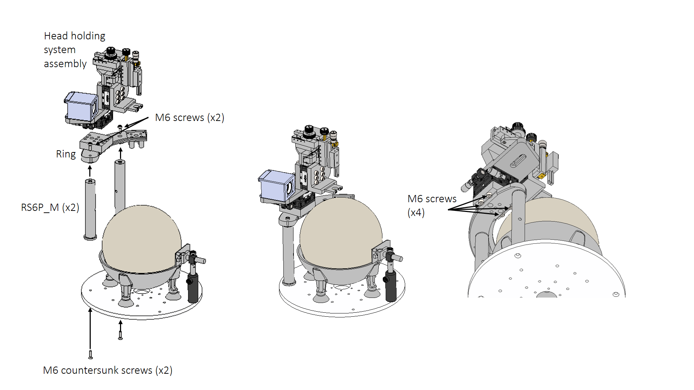
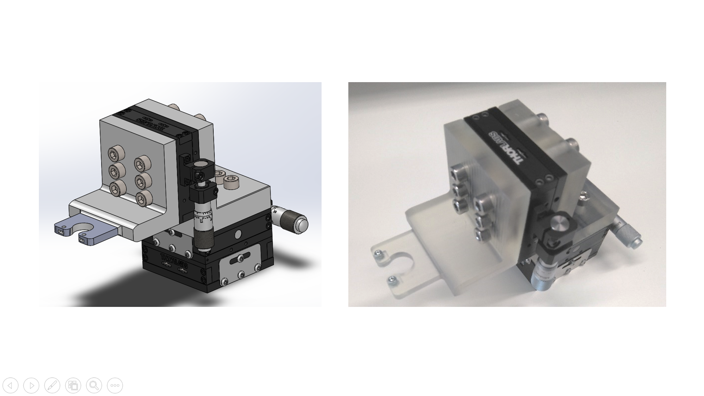

## Instrument ring

A ring-shaped instrument platform can be mounted around the sphere to hold several devices, such as an animal head-holder, cameras, and manipulators for electrical recording and optogenetic stimulation. Below we present options for head-clamps and holders for manipulating recording probes or optical fibres.

|  |
|:--:|
| *Figure 1. Ring platform and head holding system* |

## Head-plate holder

We designed a head fixation system with three degrees of freedom. The height of the head-plate holder can be adjusted to accommodate mice of different sizes. In addition, two orthogonal axes are used in the horizontal plane to adjust the position of the animal's head. This is particularly useful for vestibular experiments to centre the platform rotation axis on the vestibular organ of interest. 

This head holding system is based on assembling 3 manual Thorlabs translational stages (MT1\M) to ensure reliability and repeatability across experiments. The resolution of the system is 10 microns with a range of 13 mm in all directions.

|  |
|:--:|
| *Figure 2. Virtual assembly of the head post (left) and real assembly (right).* |

The materials needed for the assembly are: 3D printable parts (MT1/M linker, Head plate holder 1), the three MT1\M translational stages, three MT405 side mounted actuator adapters, two M2.5 nuts, two hexagonal M2.5 screws, fifteen M6 screws (two of them optional) and two M6 threaded inserts (optional). 

|  |
|:--:|
| *Figure 3. Drawings of the MT1/M linker at 1:2 scale* |

We also provide an MT1/M linker with a side-lip useable for attaching e.g. a camera or another instrument. 
An alternative Head-plate holder 2 is provided for attaching an MM33 manual micromanipulator. 

## Probe holder and optic fibre holder

A probe holder is provided for attaching e.g. a Neuronexus adaptor (Adpt-A32-OM32) to the MM33 micromanipulator for electrophysiological recordings.

For optogenetic stimulation, an optic fibre can be secured to the MM33 micromanipulator using the Thorlabs FCM13/M ferrule clamp and a custom 3D printed adaptor. This allows the positioning of the light source at the desired location over the animal's head.

|  |
|:--:|
| *Figure 6. Optical fiber holder* |

## Bill of materials
The 3D printed parts have been printed using a Form2 SLS 3D printer using the default settings with Clear V4 resin type.

| Component                           | Manufacturer    | Units           | Reference             |
|-------------------------------------|-----------------|-----------------|-----------------------|
| Instrument ring                     | 3D printed 		| 1               | [STP file](files/STEP/Ring.stp), [STL files](files/STL/Ring.stl)        |
| MT1/M linker						  | 3D printed 		| 1               | [STP file](files/STEP/linkMT1_M.stp)|
| MT1/M linker with camera holder lip | 3D printed 		| 1               | [STP file](files/STEP/linkMT1_M_camera%20modification.STEP), [STL files](files/STL/linkMT1_M_camera%20modification.STL)        |
| Head-plate holder 1				  | 3D printed		| 1				  |	[STP file](files/STEP/Head_plate_holder_1.stp)				|
| Head-plate holder 2 (for MM33 manipulator)            | 3D printed	  | 1               | [STP file](files/STEP/Head_plate_holder_2.stp), [STL file](files/STL/Head_plate_holder_2.stl)        |
| Probe holder                  	  | 3D printed 		| 1               | [STP file](files/STEP/Neuronexus%20holder.stp) |
| Optic fiber holder                  | 3D printed 		| 1               | [STP file](files/STEP/Optic%20fiber%20holder.stp), [STL file](files/STL/Optic%20fiber%20holder.stl) |
| MT1/M translational stage           | Thorlabs        | 3               | [link](https://www.thorlabs.com/thorproduct.cfm?partnumber=MT1/M#ad-image-0)                 |
| MT405 side mounted actuator adapter | Thorlabs        | 3               | [link](https://www.thorlabs.com/newgrouppage9.cfm?objectgroup_id=1908&pn=MT405#1929)                 |
| RS6P/M posts						  | Thorlabs		| 2				  | [link](https://www.thorlabs.com/newgrouppage9.cfm?objectgroup_id=851&pn=RS6P/M#1307)|
| M6 hex bold screws 16mm length      | RS components   | 15 (2 optional) | [link](https://uk.rs-online.com/web/p/socket-screws/0281114)               |
| M2.5 hex bold screws                | RS components   | 4               | [link](https://uk.rs-online.com/web/p/socket-screws/4838124)      |
| M2.5 nuts                           | RS components   | 2               | [link](https://uk.rs-online.com/web/p/hex-nuts/0560287)               |
| M6 threaded inserts                 | RS components   | 2 (optional)    | [link](https://uk.rs-online.com/web/p/threaded-inserts/6647359)              |
| M4 screws                           |                 | 3               |                       |
| M3 screws                           |                 | 2               |                       |
| Optic fibre holder (FCM ferrule clamp)				  | Thorlabs		| 1				  | [link](https://www.thorlabs.com/newgrouppage9.cfm?objectgroup_id=69)
| Left handed MM33 micromanipulator   | Märzhäuser      | 1               |[link](https://www.marzhauser.com/en/products/micromanipulators/manual-micromanipulators/mm-33.html), [datasheet](files/Datasheets/Micromanipulator/00-42-101-0000_MM_33_EN.pdf)|

