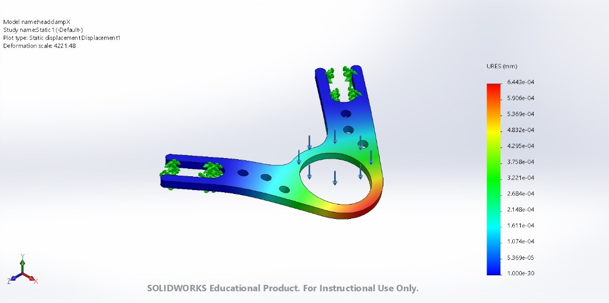

## Headplate

The design for the head-plate used with the clamp on the head-holder is shown in Figure 1. 

|  |
|:--:|
| *Figure 1. Head clamp drawings* |

We have stimulated the performance of the head-plate using different materials (Aluminum, Titanium or Steel) and thicknesses (0.8 mm - 1 mm). The comparison can be performed knowing that the materials will be manufactured using the CNC technique from a block of homogeneous and isotropic material.

The three materials simulated on the Solidworks simulation tool are:

-	Aluminum 6061-T6 1 mm of thickness (0.3g). 
-	Titanium Grade 2 0.8 mm of thickness (0.41g).
-	Stainless steel 316 0.8 mm of thickness (0.73g).

The Initial conditions for the simulation are:

-	A static load applied to the center ring (Blue arrows).
-	Three axis fixture on the parts where the metric 2.5 screws are placed (green arrows).

|  |
|:--:|
| *Figure 2. Head clamp simulations* |

The results of maximum displacements obtained for each condition

-	Aluminum max. displacement = 9.445e-04 mm
-	Titanium max. displacement = 11.79e-04 mm
-	Stainless Steel max. displacement = 6.443e-04 mm

In conclusion, with the stainless steel head plate of 0.8 mm thickness, the displacement and strain of the head clamp is less than the Aluminum one (1 mm). Otherwise with the Titanium we lose stiffness with 0.8 mm thickness.

Finally, the manufacturing supplier was 3D hubs and the chosen material:

CNC machining / Stainless steel 316L / Smoothed (Ra 1.6μm, 63μin)

The manufacturing files are available [here](files/headclamp/headclampX.IGS) and [here](files/headclamp/headclampX.STL).
