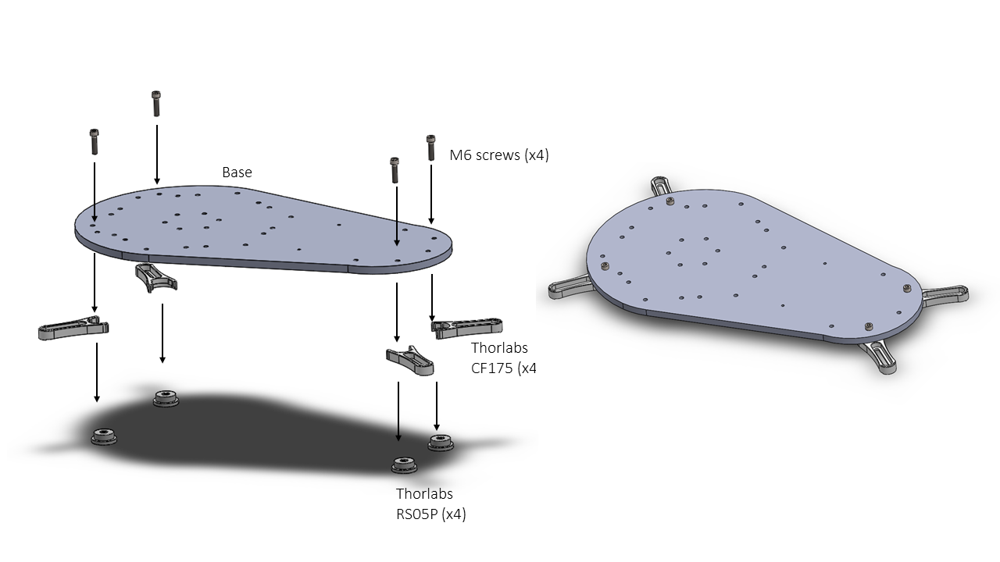
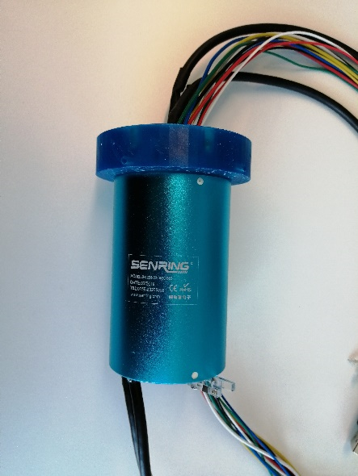
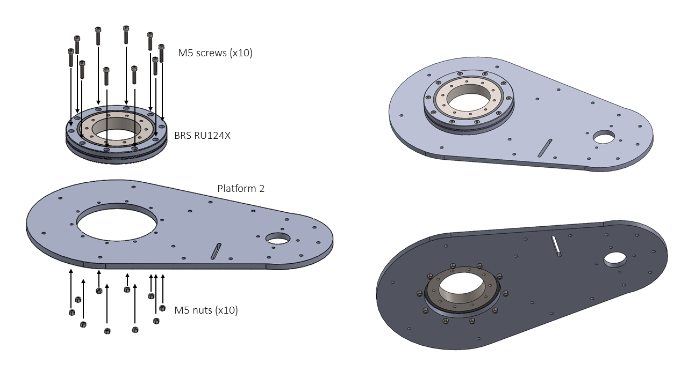
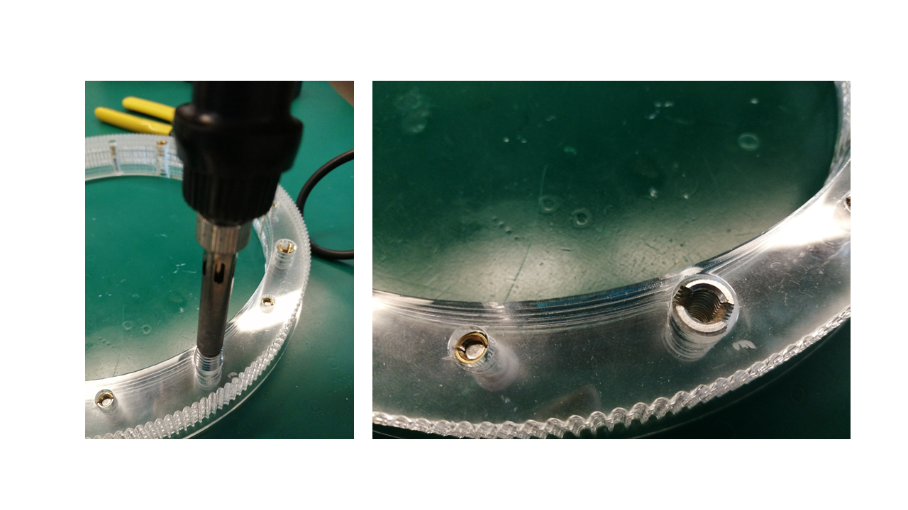
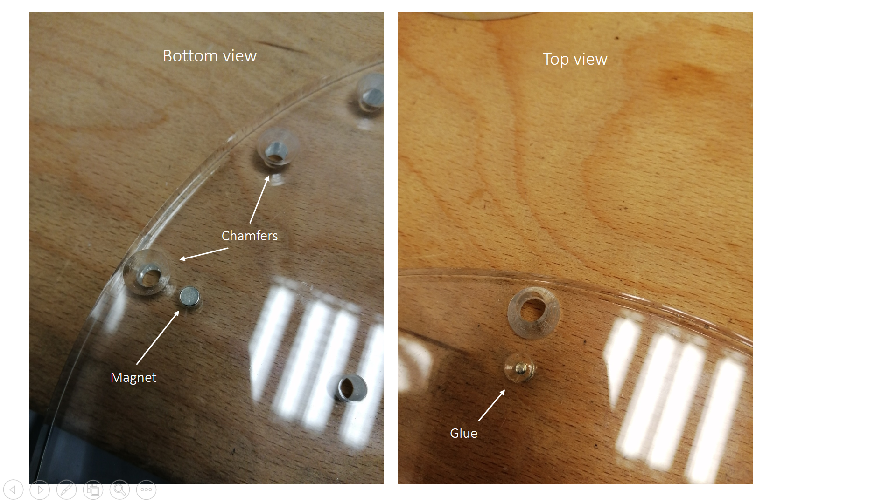
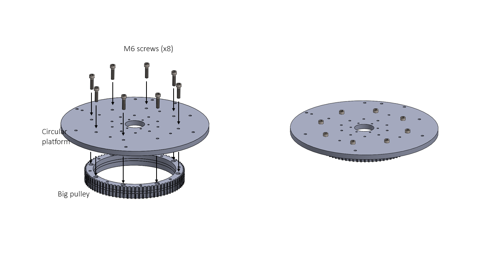
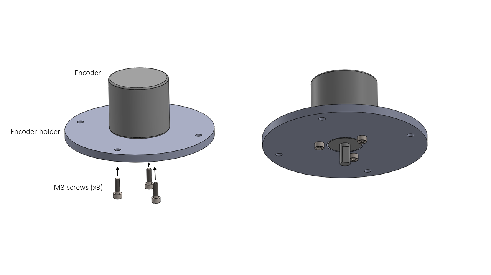
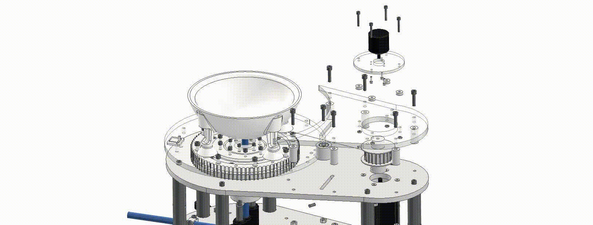

# Assembly instructions

Start assembling the Acrylic laser cut part “Base” with the Thorlabs RS05P pedestal posts and CF175 clamping forks using M6 screws. These posts are used to attach the rotary stage to the experimental table.

|  |
|:--:| 
| *Figure 1. Base assembly* |

Use two M6 screws and nuts to attach the tube guide for the compressed air tube. Attach with M6 screws the two Thorlabs posts PH_50 and the TR_50 to the base.

|  |
|:--:| 
| *Figure 2. Rotary joint telescopic posts assembly* |

The two Thorlabs PH_50 with the TR_50 are used to hold the rotary joint. To attach the rotary joint, you need two M6 or two M4 bolts with washers, depending on the position of the TR_50 (on one side is M4, on the other is M6). The compressed air tube can be installed now or at the end of the assembly.

|  |
|:--:| 
| *Figure 3. Rotary joint assembly* |

Attach the seven Thorlabs RS150 posts to the base using M6 screws. 

|  |
|:--:| 
| *Figure 4. Thorlabs RS150 assembly* |

The animation below shows the order and location of components used for the base assembly. 

| |
|:--:| 
| *Base Assembly* |

Once the rotary joint spacer is 3D printed, insert M3 brass threaded inserts and cure the part with UV light. 

|  |
|:--:| 
| *Figure 5. Rotary joint spacer threaded inserts* |

The Rotary Joint spacer is assembled with the rotary joint using 25 mm length M3 grab-screws. These are inserted using the radial holes on the bottom of the part.

|  |
|:--:|
| *Figure 6. Rotary joint spacer assembly* |

|  |
|:--:|
| *Figure 7. Rotary joint assembly* |

The crossed roller bearing BRS RU124X must be assembled with Platform 2 using ten M5 bolts and M5 nuts.

|  |
|:--:| 
| *Figure 8. Crossed roller bearing assembled with the Platform 2* |

The manufacturer recommends the following installation order:

|  |
|:--:|
| *Figure 9. Crossed roller bearing installation method (left) and Cross roller bearing installed (right)* |

!!! warning
    On the laser cut part “Platform 2”, it is recommended to drill chamfers for the M4 countersunk screws that will hold the motor. This step is important because the head of the screws has to be at the same level as the surface of Platform 2. Otherwise, they might touch the pulley or the belt.

|  |
|:--:|
| *Figure 10. Detail of the countersink screws level with the surface* |

Insert the four M4 screws with their nuts to fix the Nema 23 stepper motor to the Platform 2.

|  |
|:--:|
| *Figure 11. Motor assembly* |

The big pulley can be laser cut, as shown in Figure 12. It is composed by six layers of acrylic (2 x [layer 1](files/dxf/Big%20pulley%20(1).dxf) in 5 mm thickness, 1 x [layer 2](files/dxf/Big%20pulley%20(3).dxf) in 5 mm thickness, 2 x [layer 2](files/dxf/Big%20pulley%20(3).dxf) in 3 mm thickness and 1 x [layer 3](files/dxf/Big%20pulley%20(2).dxf) in 3 mm thickness). We recommend heating the threaded inserts with the soldering iron when inserting until they melt the plastic and go through the different layers. It is recommended to insert a couple using the external thread to get good alignment of the pulley teeth. 
Alternatively, there is an STL file to 3D print the pulley in one piece (this option has not been tested). 

|  |
|:--:|
| *Figure 12. Big pulley assembly (left) and threaded inserts (right)* |

After laser cutting the circular platform, glue a small 5 mm Neodymium magnet as indicated in Figure 13. One of the magnet surfaces has to be coincident with the bottom surface of the platform. The magnet is there to interact with the Hall effect sensor at the bottom and trigger a state change to complete the homing position. Drilling chamfers on the outside holes for the countersunk screws, as seen in Figure 13, is also essential.

|  |
|:--:|
| *Figure 13. Magnet glueing and chamfers* |

Insert eight M6 screws to attach the Circular platform with the big pulley using the threaded inserts previously installed.

|  |
|:--:|
| *Figure 14. Circular platform and big pulley assembly* |

Assemble the Base with Platform 2 using 7 M6 screws.

|  |
|:--:|
| *Figure 15. Base and Platform 2 assembly* |

The animation below shows the order and location of components used for the platform assembly. 

|  |
|:--:|
| *Platform assembly* |

Assemble the Hall Effect sensor used for the homing sequence, using two M3 screws, two Hall effect spacers and the Hall Effect holder.

|  |
|:--:|
| *Figure 16. Hall Effect sensor assembly* |

|  |
|:--:|
| *Figure 17. Hall effect sensor placement* |

To assemble the circular platform, place the platform spacer on the inner ring of the bearing, then place the circular platform (assembled previously with the big pulley) on the spacer and use the M5 screws also installed as in the first step of the bearing (Figure 18).

|  |
|:--:|
| *Figure 18. Circular platform assembly* |

The animation below shows the order and location of components used for the big pulley assembly. 

|  |
|:--:|
| *Big pulley assembly* |

Next, use the Thorlabs PH_50 and the TR_50 posts to adjust the height of the rotary joint spacer until it makes contact with the circular platform surface (Figure 19). Now you can insert six M4 screws to secure it.

|  |
|:--:|
| *Figure 19. Adjustment of the Rotary joint height* |

The shaft of the Motor is 8 mm in diameter, and the inner diameter of the [small pulley](https://uk.rs-online.com/web/p/belt-pulleys/1465412/) is 6 mm. The inner diameter of the pulley has to be increased to 8 mm with a vertical drill or milling machine (Figure 20). Add a second hole with a 3.3 mm diameter (using a 3.3 mm drill bit) to add a fixing screw that prevents the pulley from rotating around the motor shaft. Thread the hole using an M4 tap toolkit. For this step, a vice is recommended to hold the pulley while drilling. To connect the encoder shaft with the pulley, the encoder attachment must be 3D printed, and two extra 2.5 mm holes must be drilled at the top of the pulley. Then, an M3 thread must be made using the M3 tap tool. 

|  |
|:--:|
| *Figure 20. Small pulley* |

The pulley can be assembled before or after attaching the motor to platform 2.

|  |
|:--:|
| *Figure 21. Small pulley and encoder* |

The belt must envelop the small pulley when you put it on the motor shaft. You will feel a high tension when pulling the belt since it is rigid. 

!!! warning
    Remember to put the flat part of the motor shaft oriented in a comfortable position to secure with the small pulley M4 screw afterwards.

|  |
|:--:|
| *Figure 22. Small pulley with motor shaft assembly* |

Three M3 screws are used to attach the Encoder holder to the encoder.

|  |
|:--:|
| *Figure 23. Encoder holder and encoder assembly* |

Once the belt cover part is laser cut, four brass M4 threaded inserts must be inserted into the holes by heating them with the soldering iron or applying pressure.

|  |
|:--:|
| *Figure 24. M4 threaded inserts on the belt cover* |

Now four M4 screws can be inserted from the top placing the encoder spacers coincident with the holes.

|  |
|:--:|
| *Figure 25. M4 threaded inserts on the belt cover* |

The belt cover can now be installed using M6 screws, nuts and the cover spacers. After that, the encoder shaft must be in contact with the M4 grub screw at the top of the pulley.

|  |
|:--:|
| *Figure 26. Belt cover assembly* |

The animation below shows the order and location of components used for the small pulley assembly. 

|  |
|:--:|
| *Small pulley assembly* |

To regulate the belt's tension, two ball bearings are inserted on the belt tensor, and one M6 screw is used to install it in the guide. Use four washers to get a good fit on the inside and outside of the screw with the two sides of the belt cover and Platform 2.

|  |
|:--:|
| *Figure 27. Belt tensor assembly* |

|  |
|:--:|
| *Figure 28. Detail of the two ball bearings* |

Now adjust the tension of the belt. Check the belt is not touching the bottom or the top surfaces.

|  |
|:--:|
| *Figure 29. Space on both sides of the belt* |

The vertical tubing for compressed air can now be inserted through the rotary joint through-hole into the pneumatic tube elbow. Lastly, the sphere holder has to be attached with four M6 screws.

|  |
|:--:|
|  |
| *Figure 30-31. Sphere holder assembly* |

|  |
|:--:|
| *Figure 32. Complete assembly* |