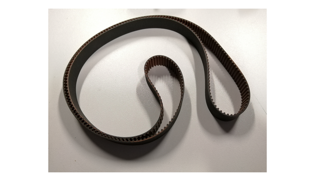

# Main components

## Rotary joint

A rotary joint enables electrical communications between the base and the rotating platform. It has a through-hole design for routing the compressed air tube. The selected model is the Senring UH1256-02-0610-06S, of the UH1256-02 Series. It has two USB ports that can be used to connect, e.g. cameras, and several power and data wires to connect different sensors and other accessories.

|  |
|:--:| 
| *Figure 1. Senring UH1256-02-0610-06S Series* |

## Crossed roller bearing

The crossed roller bearing provides a stable joint between the fixed base and the rotation platform. A suitable model for the application is the BRS RU124X considering fitting the rotary joint (inner diameter > 55mm). This bearing provides strong joint stability against axial and radial forces as well as torque due to its best-in-class axial runout (2-5 µm).

|  |
|:--:|
| *Figure 2. SBRS RU124X Crossed roller bearing* |

## DC motor and driver
To approximate the motor requirements, we have estimated the moment of inertia around the vertical axis. For this approximation, we have considered two main components: the circular platform and all the elements on the platform and the inner ring of the crossed roller bearing. To simplify the approximation, the internal ring of the bearing has been considered as a stainless steel solid part. The negligible friction force of the bearing has not been taken into account.

Both moments of inertia have been extracted using the mass properties of the Solidworks® CAD software.

With this value, we can make the approximation of the torque needed to accelerate the system using Newton’s 2nd law of rotation :
. 

After numerical simulation, we can obtain a theoretical maximum acceleration, useful to choose the motor, described by the function :

With this relationship, we can estimate the maximum torque needed for the motor. The theoretical maximum angular acceleration is 1100 °/s^2  with a 3 Nm motor option.

A stepper motor was selected accordingly: Nema 23 Stepper Motor 3 Nm 4.2A with a DM542A driver.

|  |
|:--:|
| *Figure 3. Nema 23 stepper motor and DM542A stepper driver* |

---
Nema 23 Stepper motor main features:

| Property            	| value 	|
|:---------------------	:|:-------:	|
| steps/rev           	| 200   	|
| L (mH)              	| 3.2   	|
| Imax (A) 	| 4.2   	|
| V (V)               	| 24    	|
| T (N.m)             	| 3     	|
| Pmax</max> (W) 	| 96    	|

---

The current can be selected using the first four switches of the driver DIP switch:

The driver also has a DIP switch to select the desired micro-stepping mode:

## Belt selection

We have adjusted the number of teeth  of the big and the small pulley to get a gear ratio of 4:1 considering the minimum diameter of the big pulley as the outside diameter of the crossed roller bearing BRS RU124X. 

The diameter of the small (commercially available) pulley with  = 36 teeth is 34.38 mm. Once the big and small pulley diameters (*D* and *d*) have been defined, the distance between centers (*C*) is calculated to get the desired length *L* :

The number of teeth obtained for the big pulley is 216, and the distance between centers is 260 mm. These results determined the choice of the belt for our device.
## The timing belt 
The size of the belt was calculated considering the outside diameter of the crossed roller bearing (OD > 165 mm) and the desired gear ratio of 1:4, which provides the stage of a maximum theoretical value of 12 Nm. To calculate the belt parameters, first, we consider the maximum width of the belt for our space constraints, which is 20 mm. According to the distance between centers and the pulley diameters, the required belt length is 927 mm, and the chosen belt width is 15 mm.

|  |
|:--:|
| *Figure 6. Timing belt* |

## The small pulley
The pulley driven by the Nema 23 stepper motor is a 36 teeth HTD3 metal pulley provided by RS Components.

|  |
|:--:|
| *Figure 7. Small pulley* |

## Bill of materials

3D printing was done using FormLabs Clear V4 resin. PMMA (10 mm thickness) was used for all laser-cut parts unless otherwise indicated.

| Component             	| Quantity 	| Supplier        	| Reference                                                                                                                  |
|-----------------------	|----------	|-----------------	|----------------------------------------------------------------------------------------------------------------------------|
| Resin for 3D printing		|			|					|			|
| Plastic for laser cutting	|			|					|			|
| Base                  	| 1        	| Laser cut		   	| [STEP file](files/STEP/Base.STEP)                                                                                          |
| Platform 2 (Rev1)     	| 1        	| Laser cut 	   	| [STEP file](files/STEP/Platform%202(Rev1).stp)                                                                             |
| Belt cover (Rev1)     	| 1        	| Laser cut 	   	| [STEP file](files/STEP/Belt%20cover(Rev1).stp)                                                                             |
| Circular platform     	| 1        	| Laser cut 	  	| [STEP file](files/STEP/Circular%20rotary%20stage.stp)                                                                      |                                                                                                                                                                                   
| Platform spacer			| 1			| Laser cut			| [STEP file](files/STEP/Spacer.STEP)	|
| Hall-effect sensor spacer | 2         | 3D printed		| [STEP file](files/STEP/Hall%20Effect%20sensor%20spacer.STEP)   															|	
| Hall-effect sensor holder | 1        	| 3D printed 	  	| [STEP file](files/STEP/Hall%20Efect%20sensor%20Holder.stp)                                                                |
| Big pulley (option 1)		| 2			| Laser cut			| [dxf file, layer 1, 5mm thickness](files/dxf/Big pulley%20(1).dxf)|
|							| 1			| Laser cut			| [dxf file, layer 2, 5mm thickness](files/dxf/Big pulley%20(2).dxf)|
|							| 2			| Laser cut			| [dxf file, layer 2, 3mm thickness](files/dxf/Big pulley%20(2).dxf)|
|							| 1			| Laser cut			| [dxf file, layer 3, 3mm thickness](files/dxf/Big pulley%20(3).dxf)|
| Big pulley (option 2, Rev1)     	|         	| 3D printed 	  	| [STEP file](files/STEP/Big%20pulley%20(Rev1).stp), [STL file](files/STL/Big%20pulley%20(Rev1).stl) |                                                                                                                                                                                                        
| Belt tensor           	| 1        	| 3D printed        | [STEP file](files/STEP/Belt%20tensor.STEP) | 
| Encoder holder        	| 1        	| Laser cut 	  	| [STEP file, 5mm thickness](files/STEP/Encoder%20holder.STEP)  |
| Encoder spacer        	| 4        	| Laser cut / 3D printed     | [STEP file, 5mm thickness](files/STEP/Encoder%20spacer.STEP) 	|
| Encoder attachment     	| 1        	| 3D printed      	| [STEP file](files/STEP/Encoder%20attachment.stp), [STL file](files/STL/Encoder%20attachment.stl)     |
| Cover spacer          	| 6        	| 3D printed       	| [STEP file](files/STEP/Cover%20spacer.STEP)  |
| Tube guide            	| 1        	| 3D printed      	| [STEP file](files/STEP/Tube%20guide.STEP)   |
| Rotary joint spacer   	| 1        	| 3D printed     	| [STEP file](files/STEP/Rotary%20joint%20spacer.STEP) |
| Sphere holder   			| 1        	| 3D printed    	| [STL file](files/STL/Sphere%20Holder.STL)       |
| Small pulley (Rev1)   	| 1        	| RS Components 	| [link](https://uk.rs-online.com/web/p/belt-pulleys/1465412/)  |
| Belt                  	| 1        	| Ebay            	| [link](https://www.ebay.co.uk/itm/324243196114)     |
| CF175                 	| 4        	| Thorlabs        	| [link](https://www.thorlabs.com/thorproduct.cfm?partnumber=CF175)    |
| RS05P 				  	| 4        	| Thorlabs        	| [link](https://www.thorlabs.com/thorproduct.cfm?partnumber=RS05P/M)  |
| RS150                 	| 7        	| Thorlabs        	| [link](https://www.thorlabs.com/thorproduct.cfm?partnumber=RS150/M)  |
| TR_50M                	| 2     	| Thorlabs        	| [link](https://www.thorlabs.com/thorproduct.cfm?partnumber=TR50/M)   |
| PH_50                 	| 2        	| Thorlabs        	| [link](https://www.thorlabs.com/thorproduct.cfm?partnumber=PH50/M)    |
| M6 washers            	| 2        	| Thorlabs        	| [link](https://www.thorlabs.com/newgrouppage9.cfm?objectgroup_id=248) |
| M6 screws             	| 44       	| Thorlabs        	| [link](https://www.thorlabs.com/newgrouppage9.cfm?objectgroup_id=248) |
| M5 screws             	| 24       	| Thorlabs        	| [link](https://www.thorlabs.com/newgrouppage9.cfm?objectgroup_id=248) |
| M4 screws             	| 11       	| Thorlabs        	| [link](https://www.thorlabs.com/newgrouppage9.cfm?objectgroup_id=248) |
| M3 screws             	| 7        	| Thorlabs        	| [link](https://www.thorlabs.com/newgrouppage9.cfm?objectgroup_id=248)  |
| M3 grub screw (25mm)		|			| Amazon			| [link](https://www.amazon.co.uk/25mm-Socket-Grub-Screw-Point/dp/B07SJ7XDKB)					|
| M6 nuts               	| 9        	| Thorlabs         	| [link](https://www.thorlabs.com/newgrouppage9.cfm?objectgroup_id=248)  |
| M5 nuts               	| 14       	| Thorlabs       	| [link](https://www.thorlabs.com/newgrouppage9.cfm?objectgroup_id=248)   |
| BRS RU124X bearing    	| 1        	| BRS             	| [link](http://www.rigbrsbearing.com/product/ru124x-cross-roller-ring/)   |
| Rotary Joint          	| 1        	| Senring         	| [link](https://www.senring.com/usb-conductive-slip-ring/dual-Channels/uh1256-02.html)  |
| Encoder               	| 1        	| Amazon          	| [link](https://www.amazon.co.uk/Wisamic-Incremental-Encoder-Dc5-24v-Voltage/dp/B015GYY7XU/ref=sr_1_8) |
| Hall effect sensor     	| 1        	| Amazon          	| [link](ttps://www.amazon.co.uk/gp/product/B06XHG9CYN/ref=ppx_yo_dt_b_asin_title_o07_s00?ie=UTF8&psc=1) |
| Magnet                	| 1        	| RS Components 	| [link](https://uk.rs-online.com/web/p/neodymium-magnets/7924559)  |
| Nema 23 motor & driver 	| 1        	| Ebay            	| [link](https://www.ebay.co.uk/itm/Free-Ship-Nema-23-Stepper-Motor-435oz-in-4-2A-Driver-Controller-DM542A/273805042516) |
| M6 threaded insert    	|          	| RS Components     | [link](https://uk.rs-online.com/web/p/threaded-inserts/6647359)      |
| M4 threaded insert	   	|          	| RS Components   	| [link](https://uk.rs-online.com/web/p/threaded-inserts/0278556)       |
| M3 threaded insert   		|          	| RS Components   	| [link](https://uk.rs-online.com/web/p/threaded-inserts/0278534)     															|
| Bearings              	| 2        	| RS Components 	| [link](https://uk.rs-online.com/web/p/neodymium-magnets/6190014) |
| Pneumatic tube 			| 1			| Amazon			| [link](https://www.amazon.co.uk/Sourcingmap%C2%AE-12mm-Pneumatic-Tubing-Pipe/dp/B012THTYFI)		|
| Pneumatic tube joint		| 1			| Amazon 			| [link](https://www.amazon.co.uk/Pneumatic-Connector-10Pcs-Fittings-Connectors/dp/B095RVTGTG)		|

## Datasheets and documents

| Component             	| Reference                                                                                                                |
|-----------------------	|--------------------------------------------------------------------------------------------------------------------------|
| BRS RU124X bearing	   	| [Datasheet](Datasheets%20and%20documents/Crossed%20roller%20bearing/RU-crossed-roller-bearing-BRS-Bearing.pdf)           |
| 						   	| [Inspection Report](Datasheets%20and%20documents/Crossed%20roller%20bearing/RU124X-Inspection%20Report-BRS Bearing.pdf)  |
| Nema 23 motor & driver 	| [Datasheet](Datasheets%20and%20documents/Motor%20and%20Driver/Nema23_eBay.pdf)		|
| Rotary joint 				| [Datasheet](Datasheets%20and%20documents/Slipring-Rotary%20Joint/Senring-UH1256-01-Series-SlipRing-Catalog.pdf)		|

