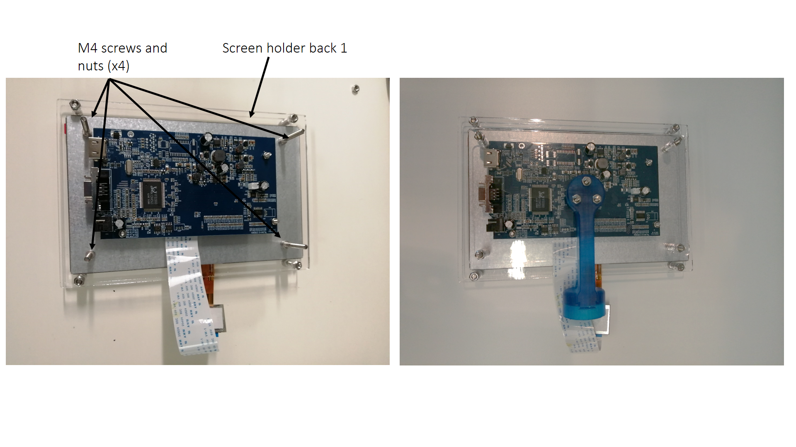

# Assembly instructions

To assemble the screen, the display and the front and back screen holders need to be attached using spacers, M4 screws and nuts.

|  |
|:--:|
|  |
| *Figure 1. Screen assembly* |

Separately assemble the 3D printed Screen attachment 1 with the back of the Screen holder.

|  |
|:--:|
| *Figure 2. Front holder assembly* |

Attach the electronic board with the screen holder back using 3 M3 screws and nuts. Then attach the two back holders with M4 screws.

|  |
|:--:|
| *Figure 3. Back holder assembly* |

|  |
|:--:|
| *Figure 4. Location of the screens on the platform* |
