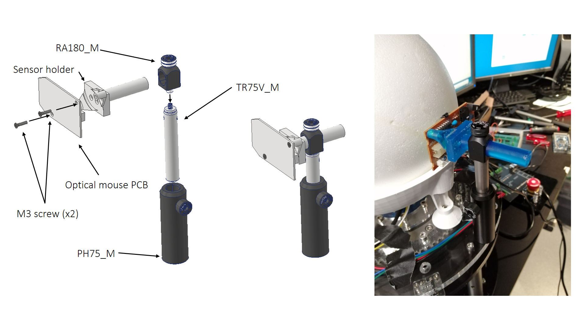

# Assembly instructions

The PCB must be removed from the optical mouse first. Then the VDD, GND, SCK and SDIO pins must be soldered to wires leading to the microcontroller and its internal 5V power supply.

|  |
|:--:|
| *Figure 1. Soldered pins on the ADNS-2610* |

Insert the two M3 brass threaded inserts into the sensor holder by applying pressure. 
Attach the sensor to the sensor holder using 2 M3 screws.

|  |
|:--:|
| *Figure 2 Optical sensor assembly* |

Then follow the instructions in Figure 3 to assemble the three Thorlabs components with the sensor holder.

|  |
|:--:|
| *Figure 3. Optical sensor assembly* |

The lens must be glued to the PCB in the correct position, with the lens aligned with the optical flow sensor.

|  |
|:--:|
| *Figure 4. ADNS-2610 glued with the lens* |

Attach the whole assembly on the rotary stage platform (e.g. at 0 or 90 degrees to the animal's anteroposterior axis).

|  |
|:--:|
| *Figure 5. Optical sensor – platform assembly* |

Connect the pins on the PCB 5V, GND, and two digital pins as shown on the "electrical setup and configuration" page. 
