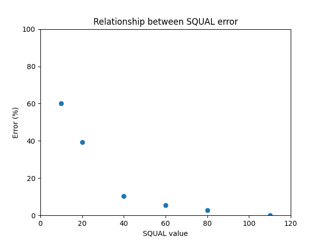
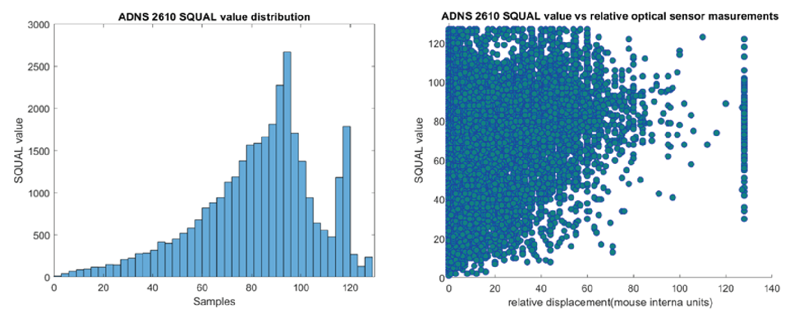

# Sensor characterization

The library to interface with the sensors is available on GitHub [[1]](#references). It provides access to the SQUAL register, which gives the reading of how good is the surface pattern to detect xy displacements. Figure 1 shows the measurement error vs the SQUAL value for one revolution of the sphere. The maximum SQUAL value was 120 (0 means no surface detection).

|  |
|:--:|
| *Figure 1. Relationship between the measurement error and the SQUAL value* |

## Characterization

The characterization of the ADNS2610 optical sensors was performed by collecting 30 revolutions of the polystyrene sphere. The number of the optical sensor internal units per revolution was 9391 on average. The polystyrene sphere has a perimeter of 61.86 cm, thus, the number of sensor internal units per cm equals 151.81.

SQUAL values were recorded simultaneously (average 82.56 ± 23.92). Figure 2 (left) shows the distribution of the SQUAL values. Figure 2 (right) shows the relationship between the rotation speed as the increment in sensor internal units between two samples and the SQUAL value. 

|  |
|:--:|
| *Figure 2. Distribution of the SQUAL values (left). Speed vs SQUAL value relationship (right)* |

## Adjustments

The vertical and horizontal positions of the sensor should be adjusted. The vertical position can be adjusted by the Thorlab post for the sensor to match the sphere's equator. Then the horizontal position can be optimized by adjusting the sensor holder until a SQUAL value higher than 100 has been achieved.

## Data
The data and code used for the sensor validation are available [here](../characterization/data/ADNS_2610_validation/ADNS_2610_validation.zip).

# References
[1] [https://github.com/zapmaker/OptiMouse](https://github.com/zapmaker/OptiMouse)
