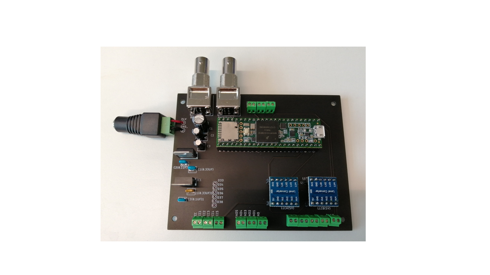
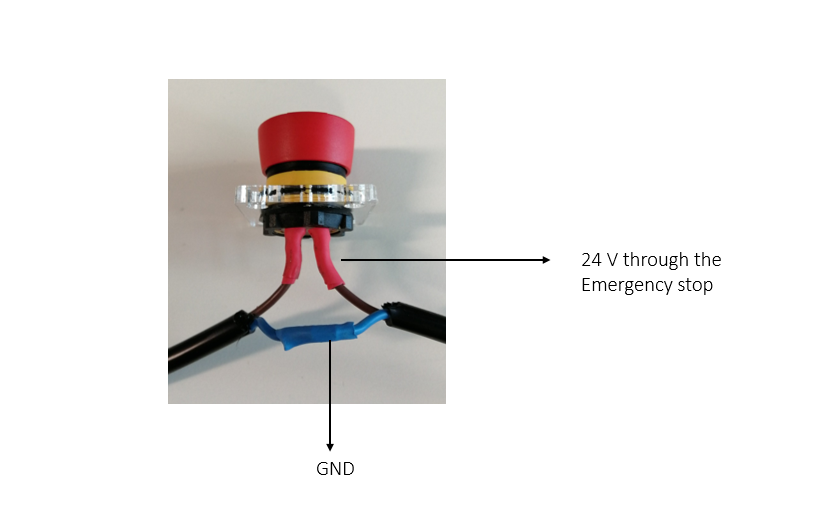

# Schematics and electrical connections

The device is controlled using a custom PCB which connects the Teensy 3.5 development board with the DM542 stepper motor driver. The board is supplied at 24V and voltage regulators provide a 5V power supply to the Teensy board. In addition, there are two bi-directional logic level shifters (5-3.3V), so up to eight 5V signals can be converted to 3.3V. Connections include two BNC connectors to the Teensy DACs, SPI pins (3.3V) and some extra digital pins at 3.3V.  

|  |
|:--:|
| *Figure 1. PCB description* |

|  |
|:--:|
| *Figure 2. PCB with components soldered* |

A simplified version of the connections of the setup is shown in Figure 3:

|  |
|:--:|
| *Figure 3. Setup connections* |

The emergency stop opens the 24V power supply circuit. The whole experimental device is disconnected if pressed.

!!! warning
    Before soldering the Emergency stop pins check the continuity between and the logic operation between pins. If the button is pressed, the circuit must be open.

|  |
|:--:|
| *Figure 4. Emergency stop connections* |

## Bill of materials
|                Component                	| Quantity 	|       Supplier      	|                                                                                Reference                                                                                	|
|---------------------------------------	|--------	|-------------------	|-----------------------------------------------------------------------------------------------------------------------------------------------------------------------	 |
| PCB                                     	|    1     	|    -                	| [Gerber files](files/Gerber%20files.zip)                                                                                                            				         |
|    Logic Level Converter Module         	|    2     	|    Amazon           	| [link](https://www.amazon.co.uk/gp/product/B0148BLZGE/ref=ppx_yo_dt_b_asin_title_o05_s00)                                                                 	|
|    Teensy 3.5 microcontroller          	|    1     	|    PJRC             	|    [link](https://www.pjrc.com/store/teensy35.html)                                                                                                                             	|
|    BNC connectors                       	|    2     	|    RS Components    	|    [link](https://uk.rs-online.com/web/p/coaxial-connectors/7100453/)                                                                                                           	|
|    12V voltage regulator L7812CV        	|    1     	|    RS Components    	|    [link](https://uk.rs-online.com/web/p/linear-voltage-regulators/7931355/)                                                                                                    	|
|    5V voltage regulator LM7805          	|    1     	|    RS Components    	|    [link](https://uk.rs-online.com/web/p/linear-voltage-regulators/7968060/)                                                                                                   	|
|    Electrolytic capacitor 330 μF 25V    	|    1     	|    Ebay             	|    [link](https://www.ebay.co.uk/c/16029438608?iid=303554359855)                                                                                                                	|
|    Electrolytic capacitor 47 μF 50V      	|    1     	|    Ebay             	|    [link](https://www.ebay.co.uk/c/16029438608?iid=303554359855)                                                                                                                	|
|    Electrolytic capacitor 1 μF 50V       	|    1     	|    Ebay             	|    [link](https://www.ebay.co.uk/c/16029438608?iid=303554359855)                                                                                                                	|
|    Ceramic capacitor 100 nF 25V         	|    2     	|    RS Components    	|    [link](https://uk.rs-online.com/web/p/mlccs-multilayer-ceramic-capacitors/5381203/)                                                                                          	|
|    Ceramic capacitor 330 nF 25V         	|    2     	|    RS Components    	|    [link](https://uk.rs-online.com/web/p/mlccs-multilayer-ceramic-capacitors/1726542/)                                                                                          	|
|    Standard female pin headers          	| 6        	|    Amazon           	|    [link](https://www.amazon.co.uk/Aussel-Pieces-Breakaway-Connector-Arduino-PIN-2-20PCS/dp/B01M69EA9O/ref=sr_1_3)    	|
|    Emergency stop                       	|    1     	|    RS Components    	| [link](https://uk.rs-online.com/web/p/emergency-stop-push-buttons/4774890)                                                                                                         |
| Hall efect sensor                       	|    1     	|    Amazon           	| [link](https://www.amazon.co.uk/gp/product/B06XHG9CYN/ref=ppx_yo_dt_b_asin_title_o07_s00)                                                                     	|

